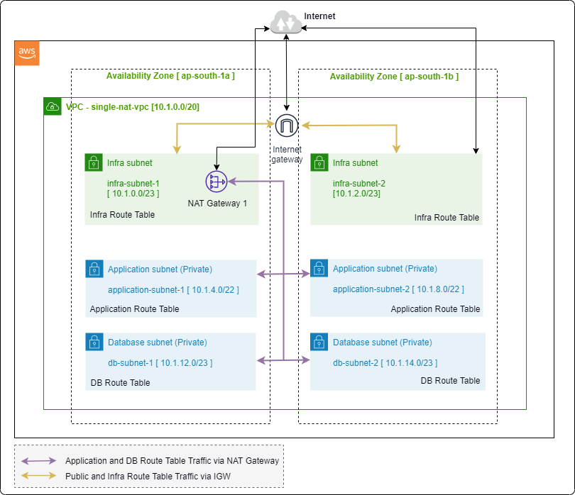

# ARJ-Stack: Terraform AWS -> VPC Example: VPC with Single NAT Gateway

This Example configuration is a demonstration of [Module: Terraform AWS VPC](https://github.com/arjstack/terraform-aws-vpc) utilization to create a AWS VPC with the following features:
 - VPC with default resources
 - Multiple subnets (For the different wrokloads) from both CIDR (primary as well as secondary CIDR)
    - Infra subnets (Public)
    - Application Subnets (Private)
    - Database subnets (Private)
 - Dedicated NACL for each subnet
 - Dedicated Route table for each subnet type (i.e. 3 Route tables)
 - Single NAT Gateway in Infra subnet
 - Defined Routes to Internet via NAT Gateway in Private Route Tables (Application and Database Subnets)
 - Well Managed tagging on resources
 - etc...
 
#### High Level Structure
---


#### Resources to be provisioned as an outcome of this example
---

| Sr. No. | Resource Type | Resource Name | Additional Details |
|:------|:------|:------|:------|
| 1 | VPC | `single-nat-vpc` | CIDR - 10.1.0.0/20 |
| 2 | Default Network ACL | `single-nat-vpc-nacl-default` |  |
| 3 | Default Route Table | `single-nat-vpc-rt-default` |  |
| 4 | Default Security Group | `single-nat-vpc-sg-default` |  |
| 5 | Internet Gateway | `single-nat-vpc-igw` |  |
| 6 | Subnet | `infra-subnet-1` | CIDR - `10.1.0.0/23`, From Secondary CIDR<br>This is Infrastructure subnet in AZ `ap-south-1a` used for Infrastructure workload |
| 7 | Subnet | `infra-subnet-2` | CIDR - `10.1.2.0/23`, From Secondary CIDR<br>This is Infrastructure subnet in AZ `ap-south-1b` used for Infrastructure workload |
| 8 | Subnet | `application-subnet-1` | CIDR - `10.1.4.0/22`<br>This is Application subnet in AZ `ap-south-1a` used for Application layer workload (Private) |
| 9 | Subnet | `application-subnet-2` | CIDR - `10.1.8.0/22`<br>This is Application subnet in AZ `ap-south-1b` used for Application layer workload (Private) |
| 10 | Subnet | `db-subnet-1` | CIDR - `10.1.12.0/23`<br>This is DB subnet in AZ `ap-south-1a` used for Database workload (Private) |
| 11 | Subnet | `db-subnet-2` | CIDR - `10.1.14.0/23`<br>This is DB subnet in AZ `ap-south-1b` used for Database workload (Private) |
| 12 | Elastic IP | `single-nat-vpc-eip-1` | This is the Elastic IP used by NAT Gateway `single-nat-vpc-nat-1` |
| 13 | Nat Gateway | `single-nat-vpc-nat-1` | This is the NAT Gateway provisioned in Infra subnet `infra-subnet-1`|
| 14 | Route Table | `single-nat-vpc-rt-infra` | This route table will be dedicated for Infrastructure Subnets (infra-subnet-1, infra-subnet-2) | 
| 15 | Route |  | Route to Destination (Internet-IPv4 traffic) via Internet Gateway `single-nat-vpc-igw` in Public Route Table `single-nat-vpc-rt-infra` |
| 16 | Route Table | `single-nat-vpc-rt-application` | This route table will be dedicated for Application Subnets (application-subnet-1, application-subnet-2) | 
| 17 | Route |  | Route to Destination (Internet-IPv4 traffic) via NAT Gateway `single-nat-vpc-nat-1` in Database Route Table `single-nat-vpc-rt-application` |
| 18 | Route Table | `single-nat-vpc-rt-database` | This route table will be dedicated for Database Subnets (db-subnet-1, db-subnet-2)| 
| 19 | Route |  | Route to Destination (Internet-IPv4 traffic) via NAT Gateway `single-nat-vpc-nat-1` in Database Route Table `single-nat-vpc-rt-database` |
| 20 | Network ACL | `single-nat-vpc-nacl-infra` | This Network ACL will be applied on Infrastructure Subnets (infra-subnet-1, infra-subnet-2)  |
| 21 | Network ACL Rule |  | Inbound Rule is created in NACL `single-nat-vpc-nacl-infra` |
| 22 | Network ACL Rule |  | Outbound Rule is created in NACL `single-nat-vpc-nacl-infra` |
| 23 | Network ACL | `single-nat-vpc-nacl-application` | This Network ACL will be applied on Application Subnets (application-subnet-1, application-subnet-2)  |
| 24 | Network ACL Rule |  | Inbound Rule is created in NACL `single-nat-vpc-nacl-application` |
| 25 | Network ACL Rule |  | Outbound Rule is created in NACL `single-nat-vpc-nacl-application` |
| 26 | Network ACL | `single-nat-vpc-nacl-database` | This Network ACL will be applied on Database Subnets (db-subnet-1, db-subnet-2) |
| 27 | Network ACL Rule |  | Inbound Rule is created in NACL `single-nat-vpc-nacl-database` |
| 28 | Network ACL Rule |  | Outbound Rule is created in NACL `single-nat-vpc-nacl-database` |
| 29 | RT-Subnet Association | `rtbassoc-xxxxxxxx` | Association of Infrastructure Route Table `single-nat-vpc-rt-infra` with Infrastructure Subnet `infra-subnet-1` |
| 30 | RT-Subnet Association | `rtbassoc-xxxxxxxx` | Association of Infrastructure Route Table `single-nat-vpc-rt-infra` with Infrastructure Subnet `infra-subnet-2` |
| 31 | RT-Subnet Association | `rtbassoc-xxxxxxxx` | Association of Application Route Table `single-nat-vpc-rt-application` with Application Subnet `application-subnet-1` |
| 32 | RT-Subnet Association | `rtbassoc-xxxxxxxx` | Association of Application Route Table `single-nat-vpc-rt-application` with Application Subnet `application-subnet-2` |
| 33 | RT-Subnet Association | `rtbassoc-xxxxxxxx` | Association of Database Route Table `single-nat-vpc-rt-database` with Database Subnet `db-subnet-1` |
| 34 | RT-Subnet Association | `rtbassoc-xxxxxxxx` | Association of Database Route Table `single-nat-vpc-rt-databse` with Database Subnet `db-subnet-2` |

## Requirements

| Name | Version |
|------|---------|
| <a name="requirement_terraform"></a> [terraform](#requirement\_terraform) | >= 1.2.5 |
| <a name="requirement_aws"></a> [aws](#requirement\_aws) | >= 4.22.0 |

## Providers

| Name | Version |
|------|---------|
| <a name="provider_aws"></a> [aws](#provider\_aws) | >= 4.22.0 |

## Usages

To run this example you need to execute:

```bash
$ terraform init
$ terraform plan
$ terraform apply
```

Note: Select the correct the AWS provider configurations in `provider.tf` file

## Authors

Module is maintained by [Ankit Jain](https://github.com/ankit-jn) with help from [these professional](https://github.com/arjstack/terraform-aws-vpc/graphs/contributors).
